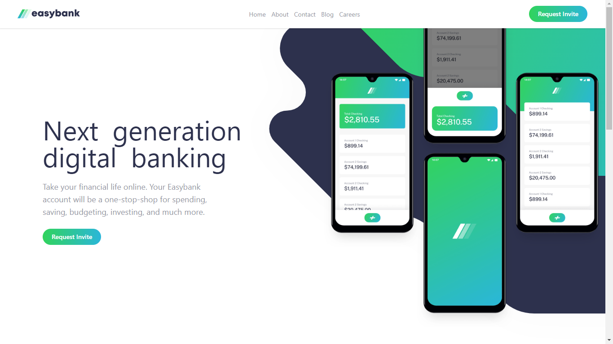

# Frontend Mentor - Easybank landing page solution

This is a solution to the [Easybank landing page challenge on Frontend Mentor](https://www.frontendmentor.io/challenges/easybank-landing-page-WaUhkoDN).

## Links

-   Solution URL: [Add solution URL here](https://your-solution-url.com)
-   Live Site URL: [Add live site URL here](https://your-live-site-url.com)

## Built with

-   Semantic HTML5 markup
-   CSS custom properties
-   Flexbox
-   CSS Grid
-   Mobile-first workflow
-   Typescript
-   [Svelte](https://svelte.dev) - JS library
-   [Svelte Kit](https://kit.svelte.dev) - For Static site generation
-   [Tailwind CSS](https://tailwindcss.com) - For styles

## Author

-   Website - [Naman Arora](https://namanarora.vercel.app)
-   Frontend Mentor - [@namanArora1022](https://www.frontendmentor.io/profile/namanArora1022)
-   Twitter - [@namanarora1022](https://www.twitter.com/namanarora1022)

## License

[MIT LICENSED](./LICENSE)
